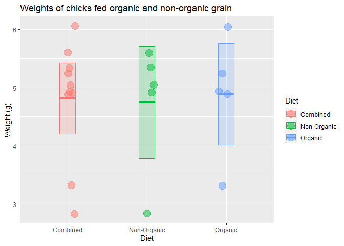

Lab 2 Assignment
================
Keenan Schissel
2021-01-19

## Instructions

Replace any triple underscores "\_\_\_" with the appropriate text.

Copy the appropriate code from your R script
[calculator.R](calculator.R) and paste it into the code chunks below.

## Code Practice

The final section of the Lab 2 instructions asks me to imagine I have
collected a sample of data which consisted of the following values:

    `6.05 4.89 3.32 4.93 5.25 5.04 4.91 2.84 5.60 5.34`

First, I combine the values into a vector using the `c()` function,
assign it to a variable named `k`, and print `k`

``` r
k <- c(6.05, 4.89, 3.32, 4.93, 5.25, 5.04, 4.91, 2.84, 5.60, 5.34)
```

Here I calculate the \`sample size, mean, median, and standard
deviation:

``` r
 length(k)  # sample size
```

    ## [1] 10

``` r
 10
```

    ## [1] 10

``` r
 median(k)  # median value
```

    ## [1] 4.985

``` r
 4.985
```

    ## [1] 4.985

``` r
 mean(k)    # mean value
```

    ## [1] 4.817

``` r
 4.817
```

    ## [1] 4.817

``` r
 sd(k)      # standard deviation
```

    ## [1] 0.9899725

``` r
 0.9899725
```

    ## [1] 0.9899725

The standard error of the mean can be calculated by dividing the
standard deviation by the square root of the sample size:

``` r
sem <- sd(k) / sqrt(k) # standard error of the mean
sem
```

    ##  [1] 0.4024811 0.4476810 0.5433180 0.4458612 0.4320594 0.4409688 0.4467683
    ##  [8] 0.5874406 0.4183397 0.4284030

``` r
mean(k) + 1.96 * sem                             # upper limit
```

    ##  [1] 5.605863 5.694455 5.881903 5.690888 5.663836 5.681299 5.692666 5.968384
    ##  [9] 5.636946 5.656670

``` r
mean(k) - 1.96 * sem                             # lower limit
```

    ##  [1] 4.028137 3.939545 3.752097 3.943112 3.970164 3.952701 3.941334 3.665616
    ##  [9] 3.997054 3.977330

``` r
c(mean(k) + 1.96 * sem, mean(k) - 1.96 * sem)    # both limits combined
```

    ##  [1] 5.605863 5.694455 5.881903 5.690888 5.663836 5.681299 5.692666 5.968384
    ##  [9] 5.636946 5.656670 4.028137 3.939545 3.752097 3.943112 3.970164 3.952701
    ## [17] 3.941334 3.665616 3.997054 3.977330

And finally, I can see the 95% confidence interval ranges from a minimum
of 4.203409 to a maximum of 5.430591

``` r
 mean(k) + 1.96 * sem                             # upper limit
```

    ##  [1] 5.605863 5.694455 5.881903 5.690888 5.663836 5.681299 5.692666 5.968384
    ##  [9] 5.636946 5.656670

``` r
 5.430591
```

    ## [1] 5.430591

``` r
 mean(k) - 1.96 * sem                             # lower limit
```

    ##  [1] 4.028137 3.939545 3.752097 3.943112 3.970164 3.952701 3.941334 3.665616
    ##  [9] 3.997054 3.977330

``` r
 4.203409
```

    ## [1] 4.203409

``` r
 c(mean(k) + 1.96 * sem, mean(k) - 1.96 * sem)    # both limits combined
```

    ##  [1] 5.605863 5.694455 5.881903 5.690888 5.663836 5.681299 5.692666 5.968384
    ##  [9] 5.636946 5.656670 4.028137 3.939545 3.752097 3.943112 3.970164 3.952701
    ## [17] 3.941334 3.665616 3.997054 3.977330

``` r
 5.430591; 4.203409
```

    ## [1] 5.430591

    ## [1] 4.203409

In this assignment I focused on using a single set of numbers, aka a
“vector”.

In the next lab we will begin using data frames, which are tables of
data consisting of multiple vectors.

As an example, imagine that the numbers above represent the weights of
chicks in an experiment. The first five numbers come from chicks that
were fed organic grain while the second were fed non-organic grain.

We could visualize the data as follows.

``` r
x<-k
library(tidyverse)
```

    ## -- Attaching packages --------------------------------------- tidyverse 1.3.0 --

    ## v ggplot2 3.3.3     v purrr   0.3.4
    ## v tibble  3.0.4     v dplyr   1.0.2
    ## v tidyr   1.1.2     v stringr 1.4.0
    ## v readr   1.4.0     v forcats 0.5.0

    ## -- Conflicts ------------------------------------------ tidyverse_conflicts() --
    ## x dplyr::filter() masks stats::filter()
    ## x dplyr::lag()    masks stats::lag()

``` r
# check to make sure you did the part above correctly
# if not, generate some fake k data
if (!exists("k") | !is.numeric(k) | !length(k) == 10) k <- rep(1, 10)

# put the chick data into a data frame
chick_data <-
  tibble::tibble(
    diet = rep(c("Combined", "Combined", "Organic", "Non-Organic"), each = 5),
    weight = c(k, k)
  )

# summarize the chick weights by diet
chick_summary <-
  chick_data %>% 
  group_by(diet) %>% 
  summarize(
    mean = mean(weight),
    median = median(weight),
    sd = sd(weight),
    n = n(),
    sem = sd / sqrt(n),
    upper = mean + 1.96 * sem,   # upper confidence limit
    lower = mean - 1.96 * sem,   # lower confidence limit
    .groups = "drop"
  )

# plot chick weights
ggplot(chick_data, aes(x = diet, y = weight, color = diet, fill = diet)) +
  geom_jitter(size = 5, shape = 21, alpha = 0.5, width = 0.1) +
  geom_crossbar(
    mapping = aes(ymin = lower, ymax = upper, y = mean), 
    data = chick_summary,
    width = 0.2, alpha = 0.2
  ) +
  labs(
    title = "Weights of chicks fed organic and non-organic grain",
    x = "Diet",
    color = "Diet",
    fill = "Diet",
    y = "Weight (g)"
  )
```

<!-- -->
